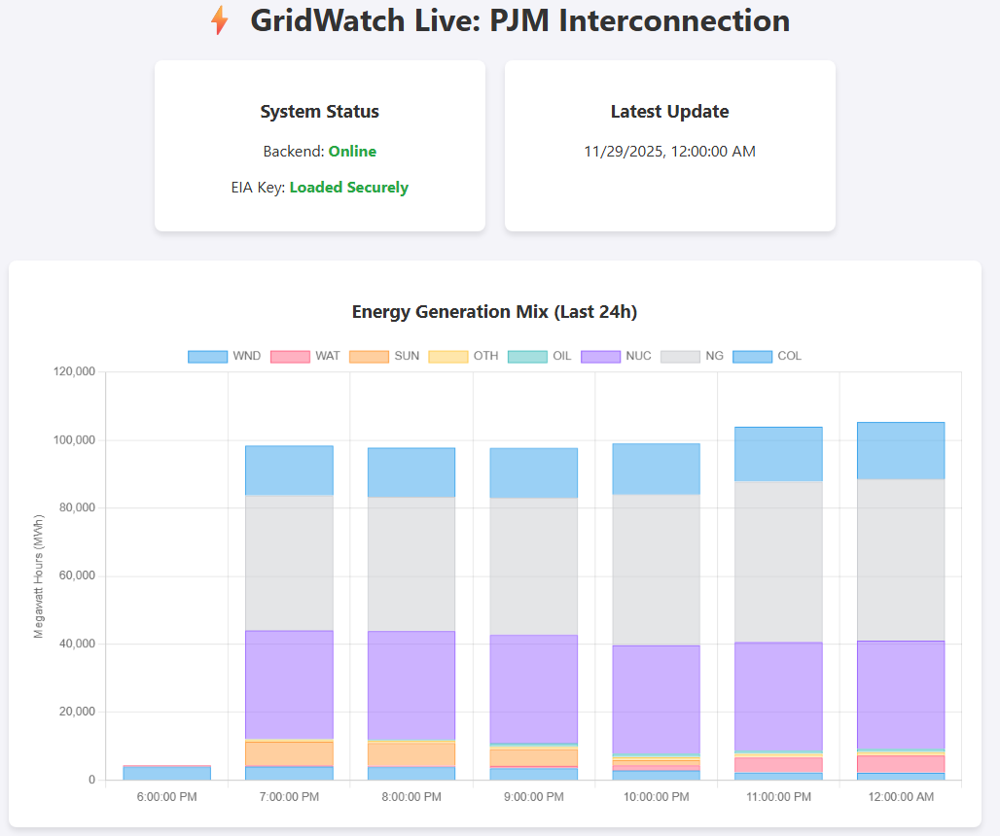

# GridWatch: Real-Time Energy Grid Visualization




GridWatch is a cloud-native, three-tier web app that visualizes real-time energy generation data from the US power grid (PJM Interconnection). It demonstrates a secure, production-ready DevOps architecture on Microsoft Azure, built entirely with Infrastructure as Code (IaC).

## Architecture

This project implements a **Hub-and-Spoke** style architecture within a secure Virtual Network (VNet). It utilizes **Azure Container Apps** for compute and **Azure Database for PostgreSQL** for persistence.

```mermaid
graph TD
    subgraph Azure_Cloud ["Microsoft Azure Region"]
        subgraph VNet ["Virtual Network (10.0.0.0/16)"]

            subgraph App_Subnet ["App Subnet (10.0.2.0/23)"]
                ACA_Env[Container App Environment]

                subgraph Web_Tier [Frontend]
                    Nginx[Nginx Container]
                end

                subgraph App_Tier [Backend]
                    FastAPI[Python FastAPI Container]
                end
            end

            subgraph Data_Subnet ["Data Subnet (10.0.4.0/24)"]
                Postgres[("Azure PostgreSQL")]
            end
        end

        KV[Azure Key Vault]
        ACR[Azure Container Registry]
    end

    User((User/Browser)) -- HTTPS --> Nginx
    Nginx -- Internal HTTP --> FastAPI
    FastAPI -- VNet Integration --> Postgres
    FastAPI -- Private Link --> KV
    FastAPI -- HTTPS (Ingress) --> EIA_API[EIA Public API]

    style VNet fill:#e1f5fe,stroke:#01579b
    style App_Subnet fill:#e0f2f1,stroke:#00695c,stroke-dasharray: 5 5
    style Data_Subnet fill:#fff3e0,stroke:#e65100,stroke-dasharray: 5 5
````

## Features

  * **Secure by Design:** The Database and API are strictly internal. Only the Nginx frontend is exposed to the public internet.
  * **Zero Hardcoded Secrets:** All credentials (DB passwords, API keys) are stored in **Azure Key Vault** and accessed via **Managed Identities**.
  * **Infrastructure as Code:** The entire environment (Networking, Compute, RBAC) is defined in **Terraform**.
  * **CI/CD:** Automated pipelines via **GitHub Actions** handle linting, building, security scanning, and blue/green deployment.

## Tech Stack

  * **Cloud:** Microsoft Azure (Container Apps, PostgreSQL Flexible Server, Key Vault, ACR)
  * **IaC:** Terraform (State stored in remote Azure Storage Backend)
  * **Backend:** Python 3.11, FastAPI, SQLAlchemy, AsyncPG
  * **Frontend:** Nginx (Reverse Proxy), HTML5/JS, Chart.js
  * **CI/CD:** GitHub Actions, Docker

## Getting Started

### Prereqs

  * Azure Subscription (Owner access required for RBAC assignments)
  * Terraform CLI \>= 1.3.0
  * Azure CLI
  * EIA Open Data API Key

### 1\. Deploy Infrastructure

Navigate to the `gridwatch-iac` directory (separate repository/folder).

```bash
# Initialize Terraform
terraform init

# Plan and Apply
terraform plan
terraform apply
```

### 2\. Configure Secrets

The pipeline requires the following secrets in GitHub:

  * `AZURE_CREDENTIALS`: Service Principal JSON
  * `ACR_LOGIN_SERVER`: Login URL for Azure Container Registry
  * `ACR_SP_CLIENT_ID`: Client ID for ACR push access
  * `ACR_SP_CLIENT_SECRET`: Client Secret for ACR push access

### 3\. Deploy Application

Pushing to the `main` branch triggers the GitHub Actions workflows:

1.  **Backend Pipeline:** Lints Python code, builds Docker image, pushes to ACR, and updates the API Container App.
2.  **Frontend Pipeline:** Builds Nginx image, pushes to ACR, and updates the Web Container App.

## Monitoring & Observability

  * **Logs:** Application logs are streamed to **Azure Log Analytics Workspace**.
  * **Health Checks:** The API implements a `/health` endpoint used by the Container App probes to ensure uptime.

-----

*Built by Christian as a Cloud Engineering Portfolio Project.*

```
```
